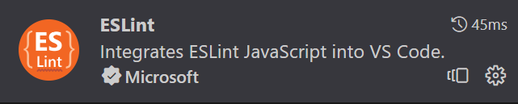

# 0 前置

## 0.1包管理工具

### yarn

```shell
npm i -g yarn --registry=https://registry.npmmirror.com
```


### pnpm（推荐）

```shell
npm install -g pnpm
```


## 0.2Vite脚手架快速搭建Vue项目实例

```shell
npm init vite@latest my-vue-app -- --template vue
```

`my-vue-app`是创建的项目的名称

`temple vue`是指快速搭建一个Vue实例模板


## 0.3Eslint配置

### 0.3.1 Eslint初始化配置

```shell
npm i -g eslint

eslint --init
```


### 0.3.2 Vscode插件安装




### 0.3.3 项目根目录配置.eslintrc.cjs

```typescript
module.exports = {
    env: {
       browser: true,
       es2021: true,
       node: true,
     },
     extends: [
       "plugin:vue/vue3-essential",
       "@vue/eslint-config-typescript/recommended"
     ],
     overrides: [
     ],
     parserOptions: {
       ecmaVersion: "latest",
       sourceType: "module",
       project: "./tsconfig.json"
     },
     plugins: [
       "vue"
     ],
     rules: {
       quotes: ["warn", "double"],
       semi: "error",
       "vue/multi-word-component-names": "off",
       "@typescript-eslint/ban-ts-comment": "off",
       "no-trailing-spaces": "error"
     }
   };
```


---

# 1 TypeScript

参考[入门教程 - TypeScript 中文文档 (nodejs.cn)](https://nodejs.cn/typescript/handbook/)

[TypeScript 教程 | 菜鸟教程 (runoob.com)](https://www.runoob.com/typescript/ts-tutorial.html)


---

# 2 Vue3 + VueRouter

参考 [Vue.js - 渐进式 JavaScript 框架 | Vue.js (vuejs.org)](https://cn.vuejs.org/)

[Vue3 教程 | 菜鸟教程 (runoob.com)](https://www.runoob.com/vue3/vue3-tutorial.html)

### 2.0 引言

一个前端项目的开发思路是，将一个项目的业务根据功能拆分成多个**页面（page）**，当前流行的**单页面（SPA）**应用，采用**VueRouter路由**的方式实现在单页面中**模拟跳转页面**。

而每个页面中，根据功能需求，将页面拆分成多个**组件（Component）**，以提高代码的复用度，举个简单的例子，在一个项目中可能有多个业务场景会用到表单（form），输入框（input），警示框（alert），只需要写一个组件即可在全项目中通用，当然组件与组件的通信和数据传输是后话，在组件2.3中会教到。


### 2.1 响应式

2.2  

### 2.3 组件

2.3 

（这里还只在单页面中把大部分的语法举例子）


### 2.4 VueRouter
