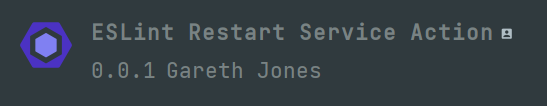
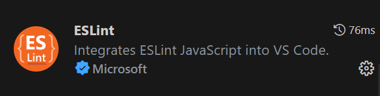

# 目录

1. **精弘网络，启动**（8.5）
   - 介绍精弘部门情况

   - 讲解本系列课程安排布置大作业

2. **Vite脚手架搭建Vue项目实例；Eslint规范团队代码**（8.5）

   - 前置技能树学习要求
   - Vite脚手架；Eslint插件

3. **Component组件模块化思维；Vue-Router切换页面路由**（8.6）
   - 组件化编程思维，功能模块封装成组件，提高代码复用率
   - SPA单页面应用，编写路由模拟多页面

4. **PropEmit父子组件传通信；Pinia变量全局存储大一统**（8.7）
   - Prop，Emit组件间通信传输数据
   - Pinia状态管理库管理存储全局状态变量

5. **Element-plus组件库组件初探；常见页面布局小试手**（8.8）
   - 上手一个组件库，妈妈再也不用担心我的界面UI太丑
   - flex布局，网格布局，响应式布局了解一下
   
6. **Axios前后端通信封装发请求；Apifox妙用管理api文档**（8.9）
   - Axios封装请求命令与后端通信
   - Apifox统一管理api接口
   
7. **前后端分离高级Mock自测试；项目对接打包终部署**（8.9）
   - 使用Apifox的高级Mock功能模拟后端发请求
   - Vite一键打包项目代码


# Day 1

大家好，欢迎大家来到浙江工业大学·精弘网络的哔哩哔哩官方频道，我是Tiancy。首先我谨代表精弘网络技术板块开发部的小伙伴们，欢迎屏幕前的你们加入到浙工大大家庭。接下来的一段时间里，将由我和我的小伙伴们以实现一个通讯录管理系统为例子，带领大家入门Vue 3渐进式框架的Web前端项目开发。

这节课主要的内容是引言，首先我要介绍一下我们精弘网络的主推产品，“微精弘”，他是一款集课程表、成绩查询、考试安排、电费查询等基本上覆盖大家在工大方方面面的学习生活的服务师生的小程序，是我们精弘网络技术部几届精弘人的产出，这样的产品并非是一蹴而就就能实现的，但也并非像想象中那么难需要高深莫测的技术栈，写出这样产品的我们，我们大部分人也都是像屏幕前的你们一样，在这个高考完的暑假，了解到精弘网络，通过暑假授课，入门Web前端开发，然后自己慢慢摸索，自学，最后从瞻仰前辈到成为前辈，坐着这里，像一个轮回，向屏幕前的你们授课。

第二，在授课前我要声明的是：我们并不像B站上其他那些培训班开设的教学视频一样夸下海口，入门前端只需要几节课的功夫，只需要投入一点点的时间。我们并没有把握说你们看完这个系列的视频就能在前端方向完完全全的入门，登堂入室，进行更高阶的学习。纸上得来终觉浅，绝知此事要躬行，我们的系列课程仅仅只是想在你们心里埋下一颗种子，想找到那些真正对开发对写代码感兴趣的小伙伴，加入到我们，和我们一起学习一起进步，仅此而已。

因此，我非常希望大家可以一边开着我们的课程，一边打开vscode，对我们的授课的代码内容进行及时的实践。所以我们也会在课程结束后布置一个项目结课大作业：即完善我们的demo，如果你感兴趣的话，你可以完善我们的demo，将你的奇思妙想，融合到这个项目中，赋予它你的理解，然后交给我们。我们会在大作业中提出我们的基础要求，但我们并不限制你们自由发挥，甚至很希望你们可以把你们的理解写出来，如果你们对我们的代码认为有可以改进的地方，我们也非常欢迎大家的探讨，我们会对提交大作业的同学，择优授予精弘网络技术部门招新的免笔试特权，可以直接参加最后的面试。

第三、我在这个系列视频的开始想说，非常希望大家可以加入精弘网络，如果你对开发项目写代码特别感兴趣，大家可以加入我们的技术宅的社群，和志同道合的开发者一起交流技术，当然如果你对产品、设计等其他软件开发方向岗位感兴趣的话，也欢迎大家在开学初的招新中向产品部、设计板块递送简历。

好，说了很多，我们开始我们的第一节课，用Vite脚手架，快速搭建我们的第一个前端项目，那么，什么是脚手架呢？且听下回分解


# Day 2

## Vite脚手架快速搭建Vue项目实例；Eslint插件规范团队代码

### 本次课程你需要点亮的**前置技能树**

1. 安装**node.js** 掌握npm包管理工具的基本使用

2. 安装**pnpm**

   ```shell
   npm install -g pnpm
   ```

   

3. 前往哔哩哔哩网站 **浙工大精弘网络**  官方频道  学习往年暑期授课的ES6和Vue语法基础

   （本期授课并不着重于基础语法，请各位Zjuter自行学习往期授课视频）

4. 安装idea，**vscode**或者**webstorm** ，这是我们写前端的必要工具 （我将以webstrom作为授课的工具）

5. 在idea中安装如下**插件** ，用于配置Eslint

   webstrom 的同学下载这个

   

   vscode 的同学下载这个

   

6. 掌握git 和github的基础使用


### 本次课程你将会学到

1. Vite脚手架快速搭建Vue项目实例

2. Eslint插件规范团队代码

3. 前端开发的项目结构，前端项目是由哪些文件组成

4. 后续课程的安排和介绍


# Day 3

## 组件化思维拆解功能模块；Vue-Router单页面实现多页面切换

### 本次课程你需要点亮的**前置技能树**

1. **Vue.js 组合式api**基础语法（参考去年授课小麦茶的教学视频和官方文档）

2. 预习了解什么是**Component组件**

3. 浏览Vue-Router官方文档，预习了解什么是路由，什么是单页面应用多页面应用，学习了解SPA的设计思路，用**pnpm**安装**vue-router@4** 

   

### 本次课程你将会学到

1. 上节课我们用Vite搭建了一个项目实例，其目录结构详解
2. 学习组件化拆分业务功能模块的编程思维
3. 了解单页面应用SPA的好处，使用Vue-Router模拟多页面效果应用于小型前端项目


### Vite搭建项目 目录结构详解

**1：dist目录**

存放打包之后的代码文件

**2：node_modules**

存放项目依赖的包目录

**3：public**

存放公共文件目录

**4：src**

存放代码的主要目录

**（1）：assets**

我这里存放了每个页面对应的css、js以及图片文件

**（2）：components**

存放项目使用的公共组件

**（3）：router**

存放vue-router相关的文件

**（4）：types**

存放typescript 支持vue文件的相关配置文件

**（5）：pages **

存放页面文件（.vue）

**（6）：App.vue**

根组件文件

**（7）：main.ts**

入口文件ts文件

```typescript
// 引入vue3中vue框架的createApp这个方法，创建一个实例
import { createApp } from "vue";
import App from "/@/App.vue";
// 创建实例
const app = createApp(App);
// 将示例挂载至节点
app.mount("#app");
```

**5：.gitignore**

Git相关文件，配置不上传至git库的文件，了解更多，请移步：《Git 忽略提交 .gitignore》

**6：index.html**

项目入口文件

**7：package.json**

存放依赖包管理及命令管理信息文件

**（1）：scripts**

```bash
"scripts": {
    "dev": "vite",
    "build": "vite build"
  },
```

这里是命令配置,我的项目时采用vite创建的，因此命令有vite

```bash
yarn dev
yarn build
```

**（2）：开发环境及生产环境**

Dependencies：生产环境 devDependencies：开发环境

​	devDependencies —— 本地开发环境使用的依赖

​	dependencies —— 线上生产(发布)环境使用的依赖

- dependencies 的包不仅开发环境能使用，生产环境也能使用，所以如果不考虑优化问题，可以将所有的依赖都安装到 dependencies 中
- 如果安装包时不写后缀，则默认是 --save，安装到 dependencies 中

**8：readme.md**

使用markdown编写的文档文件

**9：ts.config.json**

Typescript的配置文件

**10：vite.config.ts**

项目配置文件

**11：yarn.locak**

使用yarn包管理生成的文件，由yarn自动生成，自动管理。不需要管。

```bash
|-node_modules      -- 项目依赖包的目录
|-public            -- 项目公用文件
  |--vite.svg    -- 网站地址栏前面的小图标
|-src               -- 源文件目录，程序员主要工作的地方
  |-assets          -- 静态文件目录，图片图标，比如网站logo
  |-components      -- Vue3.x的自定义组件目录
  |--App.vue        -- 项目的根组件，单页应用都需要的
  |--index.css      -- 一般项目的通用CSS样式写在这里，main.js引入
  |--main.js        -- 项目入口文件，SPA单页应用都需要入口文件
|--.gitignore       -- git的管理配置文件，设置那些目录或文件不管理
|-- index.html      -- 项目的默认首页，Vue的组件需要挂载到这个文件上
|-- package-lock.json --项目包的锁定文件，用于防止包版本不一样导致的错误
|-- package.json    -- 项目配置文件，包管理、项目名称、版本和命令
```


### Vue-Router

[Vue Router | Vue.js 的官方路由 (vuejs.org)](https://router.vuejs.org/zh/)


# Day 4

## **PropEmit父子组件传通信；Pinia变量全局存储大一统**

### 本次课程你需要点亮的*，*前置技能树

1. 学会使用Components组件化思维把项目拆分成**小组件**，学习Vue.js官方文档中Prop和Emit的相关api
2. 浏览Pinia的官方文档，提前了解这一全局状态管理插件，并使用pnpm安装pinia的依赖


### 本次课程你将会学到

1. 使用Prop进行父传子通信，Emit进行子传父通信，搭建起组件间的桥梁，使得通过组件的搭配组合构建的page页面更加灵活、可拓展性强
2. 学会Pinia的基本用法，使用Pinia来对项目的状态变量进行全局存储管理，方便在仍和一个Vue组件和Vue页面使用，填补组件通信的不足之处
3. pinia-plugin-persistedstate持久化插件（仅做拓展，感兴趣的同学自行浏览官方文档[prazdevs.github.io](https://prazdevs.github.io/pinia-plugin-persistedstate/zh/guide/)）


# Day 5

## Element-plus组件库组件初探；常见页面布局小试手

### 本次课程你需要点亮的前置技能树

1. 前往Element-plus官网（[一个 Vue 3 UI 框架 | Element Plus (element-plus.org)](https://element-plus.org/zh-CN/)）自行用pnpm安装依赖并学习组件的源码
2. 前往稀土掘金等知识分享平台学习CSS和基础布局的内容


### 本次课程你将会学到

1. element-plus组件库的入门使用
2. flex，grid，和响应式布局初步认识


# Day 6

## Axios前后端通信封装发请求；Apifox妙用管理api文档

### 本次课程你需要点亮的前置技能树

1. 安装axios的依赖，看axios的文档
2. 了解http请求的原理，最起码知道什么是请求头请求体，基本的请求方式get，post
3. 了解api的概念
4. 安装apifox，看掘金的教程知道怎么用


### 本次课程你将会学到

1. axios封装发送请求
2. 学会使用apifox管理项目api文档


addService.ts 

```ts
import request from "./request.ts";
import {PersonalInfo} from "../types/personalInfo.ts";

export default class addService {
	static async add (data: PersonalInfo) {
		return request({
			"headers": {
				"Content-Type": "application/json",
			},
			url:"/Add",
			medthod: "post",
			data: data
		});
	}
}
```

loginService.ts

```ts
import request from "./request";

export default class loginService {
	static async login(data: {phone_num:string , password:string}) {
		return request({
			"headers": {
				"Content-Type": "application/json",
			},
			url: "/api/login" ,
			method: "post" ,
			data: data
		});
	}
}
```

request.ts

```ts
import axios from "axios";

const request = (config:object) => {
	const instance = axios.create({
		timeout : 1000,
	});
	return instance(config);
};

export default request;
```


login.vue

```ts
const login  = async () => {
  const loginInfo = ref({
    phone_num: input.value,
    password: password.value,
  });

  const res = await loginService.login(loginInfo.value);

  if (res.data.msg === "OK" && res.data.code === 200) {
    const responseData = res.data.data;
    const message = "亲爱的"+ responseData.username + "，欢迎回来！";
    ElNotification({
      title: "登陆成功！",
      message: h("i", { style: "color: teal" }, message),
    });
    // console.log(res.data.data.id);
    localStorage.setItem("id", responseData.id);
    newLoginStore.setLogin(true);
    newUserStore.setUserInfo({
      id: responseData.id,
      username: responseData.username,
      sex: responseData.sex,
      phone_num: responseData.phone_num,
      major: responseData.major
    });
    const router = useRouter();
    router.push("/Add");
  }

};
```


# Day7

## 前后端分离高级Mock自测试；项目对接打包终部署

### 本次课程你需要点亮的前置技能树

​	1.学完Day 6的axios发送请求和apifox的基础使用


### 本次课程你将会学到

1. axios封装发送请求
2. 学会使用apifox管理项目api文档


## 讲稿

​	在上节课中，我们学会了使用axios向后端通信，一并交给大家使用apifox的高级Mock功能，进行前后端分离的前端自测。这节课就不再赘述这块内容，直接讲解项目对接完成以后的打包和部署。

​	在用高级Mock自测各项业务，确认无误后，我们前端将正式与后端进行对接，在本地用Vite在前端开一台服务器，后端也开出一台服务器，解决跨域的问题：把前端通信的baseURL从apifox的服务器的前置URL改为后端服务器的URL，即可在本地完成测试，然后再部署到云服务器上。

​	本次课程我将继续讲解，一个已经对接好前后端请求服务的前端，如何使用Vite的build命令把项目快速打包成dist并部署到云服务器上线使用。

​	本次课程将以我们精弘网络的精弘首页前端项目为例子，讲解如何完成打包部署
